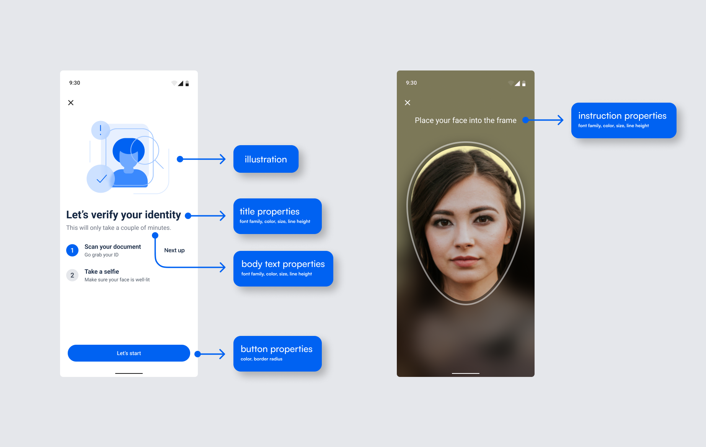
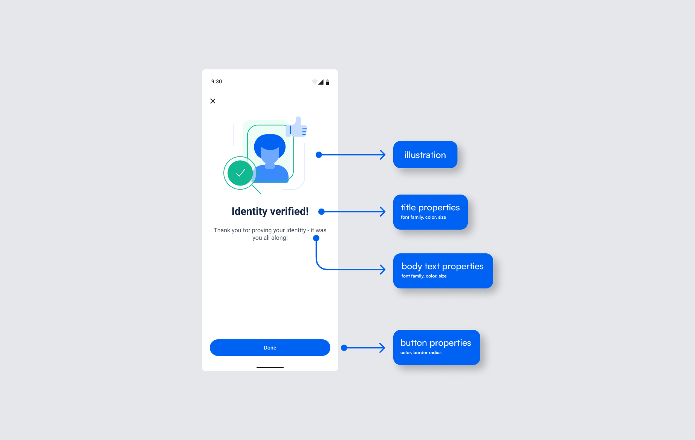
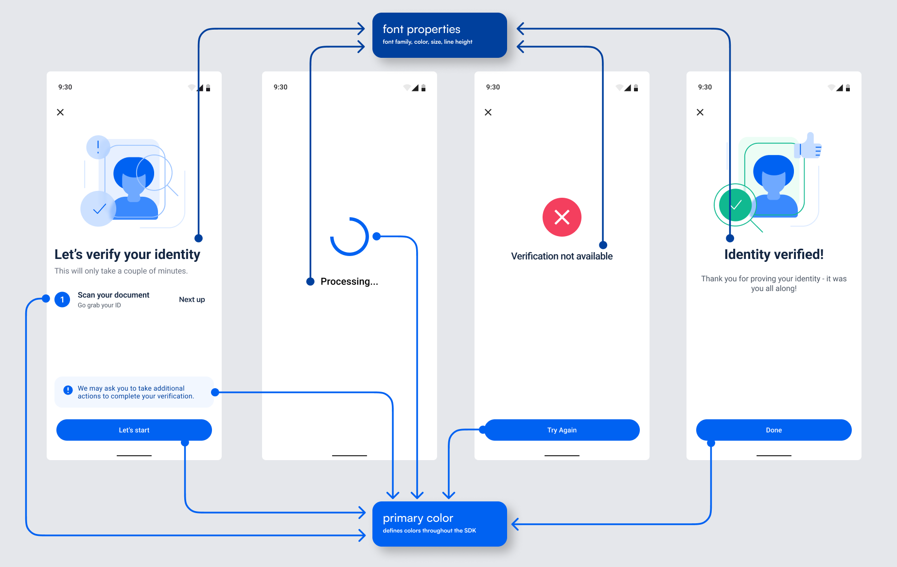
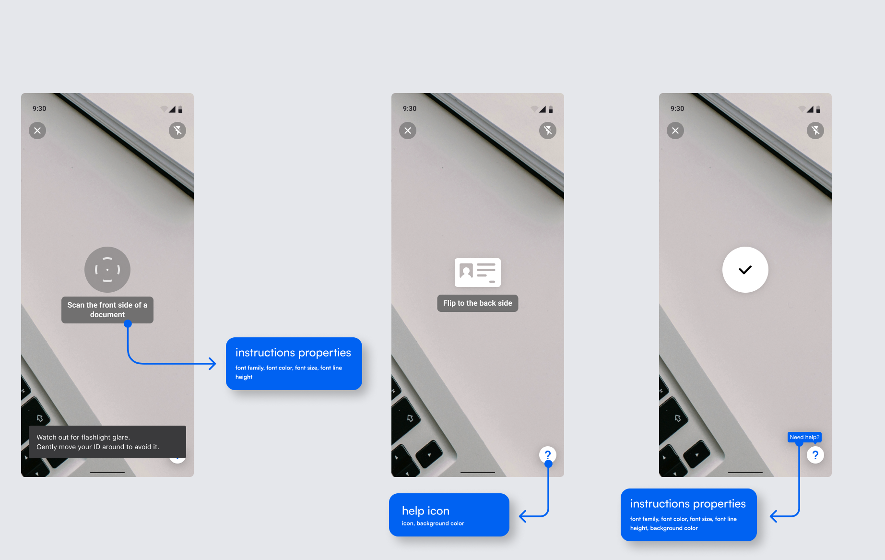
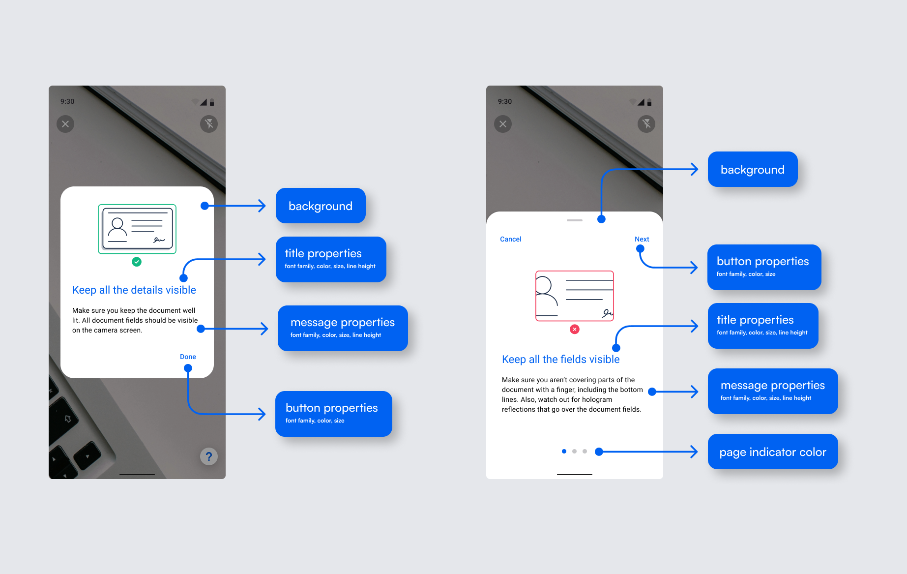

<p align="center" >
  
</p>

# Microblink Platform SDK for Android
*Microblink Platform* Android SDK enables seamless and secure user authentication by integrating advanced identity verification features, such as document scanning, facial recognition, and real-time validation, into your application. It helps businesses ensure compliance, prevent fraud, and enhance user trust with minimal development effort.

## Table Of Contents
  * [Quick start with sample apps](#quick-start-with-sample-apps)
  * [Device requirements](#device-requirements)
     * [Android version](#android-version)
     * [Processor architecture](#processor-architecture)
  * [SDK integration](#sdk-integration)
  * [SDK flow](#sdk-flow)
     * [Starting the SDK](#starting-the-sdk)
     * [Retrieving information](#retrieving-information)
  * [Backend compatibility](#backend-compatibility)
  * [Customizing the look](#customizing-the-look)
  * [Changing default strings and localization](#changing-default-strings-and-localization)
     * [Changing strings in the existing language](#changing-existing-string)
     * [Adding new language](#adding-new-language)


## <a name="quick-start-with-sample-apps"></a> Quick start with sample apps
Clone this repository and check the [**Microblink Platform**](https://github.com/MicroblinkPlatform/microblink-platform-android/tree/master/MicroblinkPlatformSample) Android Studio project with sample apps.

It contains a **Kotlin** sample `app` with detailed instructions - ([link](https://github.com/MicroblinkPlatform/microblink-platform-android/blob/main/MicroblinkPlatformSample/app/src/main/java/com/microblink/platform/sample/MainActivity.kt)) for using the **Microblink Platform SDK**.

## <a name="device-requirements"></a> Device requirements
### <a name="android-version"></a> Android version
*Microblink Platform* SDK requires **Android 7.0** (API level **24**) or newer.

### <a name="processor-architecture"></a> Processor architecture
*Microblink Platform* SDK is distributed with **ARMv7** and **ARM64** native library binaries.

*Microblink Platform* is a native library written in C++ and available for multiple platforms. Because of this, *Microblink Platform* cannot work on devices with obscure hardware architectures. We have compiled SDK's native code only for the most popular Android [ABIs](https://en.wikipedia.org/wiki/Application_binary_interface).

If you are combining *Microblink Platform* library with other libraries that contain native code in your application, make sure to match the architectures of all native libraries. For example, if the third-party library has only ARMv7 version, you must use exactly ARMv7 version of *Microblink Platform* with that library, but not ARM64. Using different architectures will crash your app at the initialization step because JVM will try to load all its native dependencies in the same preferred architecture and fail with `UnsatisfiedLinkError`.

To avoid this issue and ensure that only architectures supported by the *Microblink Platform* library are packaged in the final application, add the following statement to your `android/defaultConfig` block inside `build.gradle.kts`:

```
android {
    ...
    defaultConfig {
        ...
        ndk {
            // Tells Gradle to package the following ABIs into your application
            abiFilters += listOf("armeabi-v7a", "arm64-v8a")
        }
    }
}
```

## <a name="sdk-integration"></a> SDK integration
To integrate our SDK into your project, follow these steps:

1. **Copy the Library Files**
	- Copy the `.aar` files from the `libs` folder in this repository into a `libs` folder in your project/module.
	- Add the following to your `settings.gradle.kts` file to ensure the `.aar` files can be resolved:
	
		```kotlin
		dependencyResolutionManagement {
    		repositories {
       		 flatDir {
         		   dirs(rootDir.absolutePath + "/../libs")
       		 	}
   		 	}
		}
		```
    
	- Reference these `.aar` files in your `build.gradle.kts` file as shown below.

2. **Add Required Dependencies**
	- Include the following dependencies in your `build.gradle.kts` file to ensure proper functionality.

Check out the sample app for an example of using a TOML version catalog.

```kotlin
implementation(libs.mbp.core) {
  artifact {
    type = "aar"
  }
}

implementation(libs.mbp.liveness) {
  artifact {
    type = "aar"
  }
}

// Navigation
implementation(libs.androidx.compose.navigation)

// Protobuf
implementation(libs.protobuf.kotlin.lite)

// BlinkID Verify SDK
implementation(libs.blinkid.verify.ux)
```

## <a name="sdk-flow"></a> SDK flow
### <a name="starting-the-sdk"></a> Starting the SDK
To start the SDK, call `MicroblinkPlatform.startVerification` method with the prepared configuration:

```kotlin
MicroblinkPlatform.startVerification(this, createMbpConfig())
```

Configuration example:

```kotlin
private fun createMbpConfig() = MicroblinkPlatformConfig(
        mbpResultListener = mbpResultListener,
        mbpServiceSettings = MicroblinkPlatformServiceSettings(
            // IMPORTANT: Replace the following values with your own
            workflowId = "your_workflow_id",
            hostUrl = "your_host_url",
            // add your additional request headers if needed, e.g. for authorization
            additionalRequestHeaders = mapOf("Authorization" to "Bearer your_token"),
        ),
        mbpUiSettings = MicroblinkPlatformUiSettings(
            // customize the UI if needed
        ),
        consent = MicroblinkPlatformConsent(
		// replace with real user ID
		userId = "user_id",
                // Represents collected end-user's consent for their data
		// to be processed and stored by Microblink.
		// The end-user's consent is required for us to be able to complete the KYC verification.
                isProcessingStoringAllowed = true,
                // Additionally, represents collected end-user's consent for their
   		// data to be used by Microblink for the improvement of the
   		// fraud detection capabilities in our own products (ie. for training our models).                        
		isTrainingAllowed = true,
	)
    )
```

### <a name="retrieving-information"></a> Retrieving information
Verification results are returned via `MicroblinkPlatformResultListener`

```kotlin
private val mbpResultListener = object : MicroblinkPlatformResultListener {
        override fun onVerificationFinished(result: MicroblinkPlatformResult) {
            when (result.state) {
                MicroblinkPlatformResult.FinishedState.Success -> // Handle successful verification
                MicroblinkPlatformResult.FinishedState.Failure -> // Handle failed verification
                MicroblinkPlatformResult.FinishedState.Review -> // Handle verification that requires manual review
            }
            // use the transaction ID if needed
           	val transactionId = result.transactionId
        }

        override fun onVerificationCanceled() {
            // Handle verification cancellation
        }

    }
```

## <a name="backend-compatibility"></a> Backend compatibility
In order to use the SDK, you need to define a proxy service which will be used to communicate with the Microblink Platform. This service should be used to forward requests from the SDK to the Microblink Platform and back in order to start the transaction. The service should be implemented on your side and SDK will use it to communicate with the platform.

> [!IMPORTANT]
> To use our API, you will need an `workflowId` and `hostUrl`.  [Please reach out to us to obtain these credentials](https://microblink.com/contact-us/).

Make sure that you use a compatible Workflow version for the `Microblink Platform` Android library version that you use.

## <a name="customizing-the-look"></a> Customizing the look
It is not possible to move elements of the UI around, remove parts of the UI, or add new parts.

The *Microblink Platform* SDK comes with the ability to customize some aspects of the UI by using the UI theming. The screens can be customized to fit your app’s look and feel by defining UI settings.

<p align="center"></p>
<p align="center"></p>
<p align="center"></p>
<p align="center"></p>
<p align="center"></p>

It is possible to change the images on the home screen, and each of possible result screens. Just pass the Drawables when creating `MicroblinkPlatformUiSettings` as below:

```kotlin
 mbpUiSettings = MicroblinkPlatformUiSettings(
        mbpImages = MicroblinkPlatformImages(
                home = R.drawable.mbp_home,
                verificationFail = R.drawable.mbp_verification_fail,
                verificationSuccess = R.drawable.mbp_verification_success,
                verificationReview = R.drawable.mbp_verification_review,
                cameraPermission = R.drawable.mbp_camera_permission,
            ),
        )
```

To change only the `FontFamily` of all texts, you can use the default typography defined in the SDK and just pass a different `FontFamily`. All of the other parameters (font weight, font size, line height, etc) will stay the same.
For example:

```kotlin
// load any FontFamily
private val allerta = FontFamily(
        Font(R.font.allerta, FontWeight.Normal),
    )

mbpUiSettings = MicroblinkPlatformUiSettings(
             typography = MicroblinkPlatformTypography.default(allerta),
             documentScanningTypography = ParcelableUiTypography.Default(allerta)
        )
```

If you wish to change other parameters, you can set `TextStyle` for each part of the SDK. For example, to change the home screen title font:

```kotlin
mbpUiSettings = MicroblinkPlatformUiSettings(
            typography = MicroblinkPlatformTypography(
                homeTitle = TextStyle(
                    fontWeight = FontWeight.Bold,
                    fontSize = 28.sp,
                    lineHeight = 32.sp,
                    color = DeepBlue
                ),
            )
        )
```

To change the color scheme (e.g. button or background colors), set the `androidx.compose.material3.ColorScheme` in `MicroblinkPlatformUiSettings`:

```kotlin
mbpUiSettings = MicroblinkPlatformUiSettings(
            colorScheme = lightColorScheme(
                primary = Cobalt,
                background = Color.White,
            )
        )
```

To change the Try againg/Let's start button shape, set the `ButtonShape` in `MicroblinkPlatformUiSettings`:

```kotlin
mbpUiSettings = MicroblinkPlatformUiSettings(
            buttonShape = ButtonShape(shape = CircleShape)
        )
```

## <a name="changing-default-strings-and-localization"></a> Changing default strings and localization
SDK is available in English. You can modify all of the strings and add your own language. For more information on how localization works in Android, check out the [official Android documentation](https://developer.android.com/guide/topics/resources/localization).

### <a name="changing-existing-string"></a> Changing existing strings
To modify an existing string, the best approach would be to:


1. Check out all the available strings you can change in the [`strings.xml`](https://github.com/MicroblinkPlatform/microblink-platform-android/tree/main/strings/strings.xml).
2. Choose a string key that you want to change. For example: `<string name="mb_result_done">Done</string>`.
3. In your project, create a file `strings.xml` in the folder `res/values` if it doesn't already exist.
4. Create an entry in the file with the value for the string. For example: `<string name="mb_result_done">Accept</string>`.
5. Repeat for all the strings you wish to change.

### <a name="adding-new-language"></a> Adding new language
The *Microblink Platform* SDK can easily be translated into other languages. The [`strings.xml`](https://github.com/MicroblinkPlatform/microblink-platform-android/tree/main/strings/strings.xml) contains all the strings used in the *Microblink Platform* library. In order to make e.g. German translation, create a folder `res/values-de` in your project and create a `strings.xml` inside it. Then, open that file and create entries for strings you wish to translate. E.g., for the string `mb_result_done`, you should create an entry like this: `<string name="mb_result_done">Bestätigen</string>`
